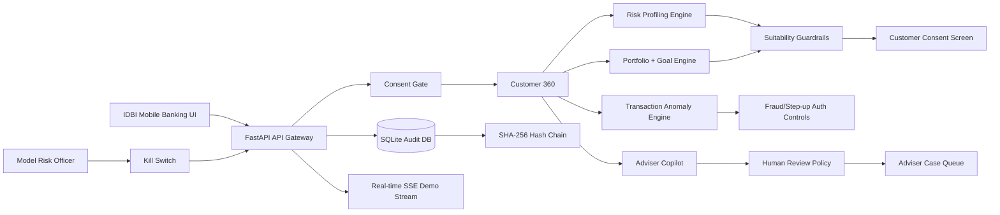

# NiveshSetu AI — Bank-Grade Wealth Advisory + Mobile Banking Copilot

**Submission title:** NiveshSetu AI: Explainable Wealth Advisory + Mobile Banking Copilot for IDBI Bank  
**Hackathon fit:** IDBI Innovate 2026 — AI/ML banking innovation, wealth advisory, conversational AI, mobile banking, data analytics, and implementation-ready PoC.

NiveshSetu AI is a production-style FastAPI prototype that turns mobile banking into a trusted financial guidance layer. It combines explainable suitability scoring, goal-linked portfolio planning, transaction anomaly detection, adviser copilot, consent capture, model-risk governance, real-time event streaming, human review, and SHA-256 audit-chain verification.

This is intentionally **not** a generic chatbot. It is designed like a bank PoC with controls that judges can inspect live.

---

## Winning One-Liner

**NiveshSetu AI helps IDBI Bank deliver safe, explainable, consent-based wealth guidance inside mobile banking — with fraud signals, human review, kill switch, and tamper-evident audit logs built in.**

---

## Why This Can Win

| Judge Need | NiveshSetu AI Proof |
|---|---|
| Real banking impact | Converts idle savings into goal-linked RD/SIP journeys and raises digital engagement. |
| AI/ML depth | Risk engine, portfolio engine, anomaly engine, adviser copilot, model registry, drift/fairness reports. |
| Feasibility | Runs locally, on Termux, Docker, or cloud with no paid API dependency. |
| Compliance thinking | Consent gate, suitability guardrails, human review, no execution, audit chain, model kill switch. |
| Demo strength | One dashboard with real-time progress, KPI cards, risk profile, recommendation, fraud scan, governance, audit verification. |
| Scalability | API-first architecture ready for bank sandbox/core banking/mobile/CRM integrations. |

---

## 50+ Advanced Integrated Features

### Wealth Advisory Intelligence
1. Explainable risk profiling engine  
2. Component-level suitability scoring  
3. Conservative/Balanced/Growth bucketing  
4. Risk confidence score  
5. Financial capacity scoring  
6. Emergency-buffer logic  
7. Debt-to-income suitability penalty  
8. Goal-horizon scoring  
9. Behavioral volatility-tolerance scoring  
10. Product-neutral allocation engine  
11. Goal-linked SIP/RD simulator  
12. Required SIP calculation  
13. Goal completion percentage  
14. Monthly SIP gap calculation  
15. Stress testing for drawdowns  
16. Income-shock scenario  
17. Emergency-fund-first goal ladder  
18. Rebalancing rules  
19. Human review for high-risk cases  
20. Customer consent requirement

### Mobile Banking Intelligence
21. Synthetic mobile-banking transaction stream  
22. Customer 360 profile  
23. Spend category breakdown  
24. Channel mix analytics  
25. Savings-rate estimate  
26. Behavioral nudges  
27. Auto-sweep concept  
28. Real-time transaction tick stream  
29. API-based transaction risk scoring  
30. Mobile-first dashboard

### Fraud / Anomaly Intelligence
31. Category z-score anomaly detection  
32. Late-night risk detection  
33. New-payee risk signal  
34. Unknown merchant risk signal  
35. New-device risk signal  
36. Geographic jump signal  
37. Velocity signal  
38. Protected-value estimate  
39. Step-up authentication recommendation  
40. Fraud desk review recommendation

### Conversational AI / Adviser Copilot
41. Guardrailed adviser chat endpoint  
42. Knowledge-base citations  
43. Confidence score  
44. Human review recommendation  
45. Next-best-action generation  
46. No trade/order execution  
47. Fallback when kill switch is paused

### Governance / Compliance / Security
48. Model registry  
49. Model cards  
50. Validation report  
51. Drift report  
52. Fairness/proxy-risk report  
53. Governance scorecard  
54. Model kill switch  
55. Consent capture endpoint  
56. Human approval case queue  
57. SQLite audit trail  
58. SHA-256 chained audit verification  
59. Security headers middleware  
60. API docs via OpenAPI

### Real-Time / Production Readiness
61. Server-Sent Events `/api/realtime/events`  
62. Real-time judge demo progress stream  
63. Sandbox connector status  
64. Data-contract endpoint  
65. Health endpoint with audit check  
66. Metrics endpoint  
67. Dockerfile  
68. Procfile for cloud  
69. Termux-ready dependency set  
70. Unit tests

---

## System Architecture



---

## API Endpoints

| Method | Endpoint | Purpose |
|---|---|---|
| GET | `/` | Dashboard |
| GET | `/docs` | OpenAPI docs |
| GET | `/health` | Health + model state + audit verification |
| GET | `/api/demo/state` | Judge-ready state, KPIs, customer, metrics |
| GET | `/api/customer/360` | Consent-gated customer financial view |
| POST | `/api/consent/capture` | Customer consent event |
| POST | `/api/risk/profile` | Explainable suitability profile |
| POST | `/api/portfolio/recommend` | Goal-linked product-neutral plan |
| POST | `/api/goal/simulate` | Goal ladder + scenario simulation |
| POST | `/api/advisor/chat` | Guardrailed adviser copilot |
| GET | `/api/transactions/sample` | Synthetic banking transactions |
| POST | `/api/transactions/risk-score` | Score risky transaction |
| GET | `/api/anomalies` | Fraud/anomaly alerts |
| POST | `/api/kill-switch` | Pause/enable AI model |
| POST | `/api/recommendations/approve` | Create human review case |
| GET | `/api/recommendations/cases` | Adviser case queue |
| GET | `/api/audit` | Audit events |
| GET | `/api/audit/verify` | Verify hash chain |
| GET | `/api/audit/stats` | Audit statistics |
| GET | `/api/governance/model-cards` | Model registry/cards |
| GET | `/api/governance/validation` | Model validation report |
| GET | `/api/governance/drift` | Drift monitoring report |
| GET | `/api/governance/fairness` | Fairness/proxy-risk report |
| GET | `/api/governance/scorecard` | Governance score |
| GET | `/api/sandbox/status` | Mock bank connector readiness |
| GET | `/api/sandbox/data-contracts` | Data contracts |
| GET | `/api/progress/demo` | Full judge flow steps |
| GET | `/api/realtime/events` | Live SSE transaction/model/audit stream |
| GET | `/api/realtime/demo-run` | Live SSE judge demo progress |
| GET | `/api/metrics` | Business, technical, governance metrics |

---

## Local Setup

```bash
python -m venv .venv
source .venv/bin/activate
pip install -r requirements.txt
python -m pytest -q
python -m uvicorn app.main:app --host 0.0.0.0 --port 8000 --reload
```

Open:

```text
http://127.0.0.1:8000
```

Docs:

```text
http://127.0.0.1:8000/docs
```

---

## Termux Setup

```bash
pkg update -y
pkg install python git rust clang make pkg-config llvm lld -y
cd ~/niveshsetu_ai
python -m venv .venv
source .venv/bin/activate
pip install --upgrade pip setuptools wheel
pip install -r requirements.txt
python -m pytest -q
python -m uvicorn app.main:app --host 0.0.0.0 --port 8000 --reload
```

---

## Judge Demo Flow

1. Open dashboard.
2. Click **Run Judge Demo**.
3. Show live progress stream.
4. Generate risk profile and explain component scores.
5. Generate portfolio and show stress test.
6. Scan transaction anomalies and show step-up authentication controls.
7. Ask adviser copilot an emergency-fund/SIP question.
8. Show governance scorecard, drift, fairness, validation, and model cards.
9. Pause AI through kill switch and show safe fallback.
10. Verify audit chain and show SHA-256 hashes.

---

## Production Hardening Path

For a real bank deployment, connect this PoC to:

- Bank OAuth/OIDC and RBAC
- Customer consent ledger
- Read-only core banking/customer API
- Transaction streaming pipeline
- Approved product-shelf service
- Adviser CRM workflow
- SIEM/log lake for audit retention
- Independent model validation
- Legal/compliance-approved advisory wording
- VA/PT and security review

---

## 60-Second Pitch

NiveshSetu AI transforms IDBI mobile banking from a transaction app into a trusted financial guidance layer. It profiles customer risk, detects savings capacity, creates goal-linked SIP/RD plans, flags unusual transactions, and explains every recommendation in plain language. Unlike a generic chatbot, it has suitability guardrails, customer consent, adviser review, model validation, a kill switch, and SHA-256 audit-chain verification. That makes it practical for a bank sandbox, compelling for customers, and credible for regulators.
