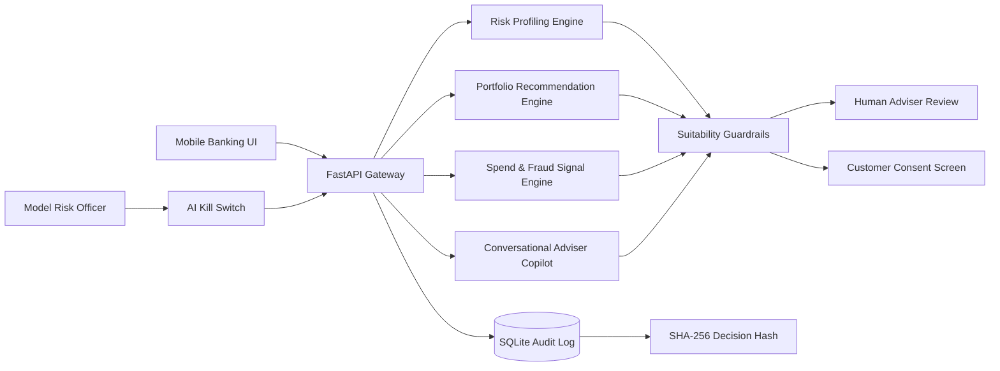

# NiveshSetu AI — Explainable Wealth Advisory for IDBI Innovate 2026

**Tagline:** Bank-grade, explainable AI wealth advisory inside mobile banking.

NiveshSetu AI is a production-ready hackathon prototype for **IDBI Innovate 2026**. It combines three high-value banking tracks in one coherent solution:

1. **AI-powered digital wealth advisory**
2. **Conversational AI adviser copilot**
3. **Mobile banking intelligence and anomaly detection**

It is intentionally built as a bank PoC, not a generic chatbot. Every recommendation includes risk profiling, suitability guardrails, portfolio reasoning, human-review routing, model kill switch, and SHA-256 audit trail.

---

## Why this can win

| Judge Criterion | How NiveshSetu AI addresses it |
|---|---|
| Innovation | Combines wealth advisory + mobile banking + explainable AI governance in one deployable flow. |
| Feasibility | Runs locally or on cloud with FastAPI, SQLite audit trail, synthetic banking transactions, and sandbox-style APIs. |
| Scalability | Stateless API-first design; can be deployed behind bank auth, API gateway, and data lake pipelines. |
| Business Impact | Converts idle savings into goal-linked SIP/RD journeys, improves customer engagement, and creates advisory cross-sell opportunities. |
| Technical Implementation | Risk engine, portfolio engine, anomaly engine, conversational copilot, audit logging, model governance, frontend demo. |
| Compliance Readiness | Risk profiling, suitability checks, human review, customer consent step, decision hashes, model kill switch. |

---

## 30+ Advanced Features

### Wealth Advisory Intelligence
1. Transparent risk profiling engine  
2. Suitability scoring from age, income, expenses, dependents, horizon, emergency fund, volatility comfort, and debt ratio  
3. Conservative / Balanced / Growth investor bucketing  
4. Explainable reason trace for every score  
5. Product-neutral portfolio allocation  
6. Goal-linked SIP simulator  
7. Projected value and required SIP calculation  
8. Goal gap calculation  
9. Rebalancing rule generation  
10. Human-review trigger for high-risk recommendations  

### Mobile Banking Intelligence
11. Synthetic banking transaction stream  
12. Spend categorization  
13. Overspending detection  
14. Late-night transaction flagging  
15. High-value unknown merchant flagging  
16. Category-level z-score anomaly detection  
17. Savings nudge from spending patterns  
18. Auto-sweep concept: salary → reserve → emergency fund → SIP/RD  

### Conversational AI / Copilot
19. Banking advisory assistant endpoint  
20. Confidence score  
21. Guardrail message for every answer  
22. Human-review recommendation for sensitive outputs  
23. Knowledge-base citations for demo transparency  
24. Works without external API keys  

### Governance, Compliance, Security
25. Model governance kill switch  
26. Audit log in SQLite  
27. SHA-256 decision hashing  
28. Actor/action/payload traceability  
29. Human approval endpoint  
30. Security headers middleware  
31. Customer consent handoff design  
32. No real trade execution in demo  
33. Clear regulated-advice disclaimer  

### Demo and Product Readiness
34. One-click judge demo button  
35. Live KPI cards  
36. Responsive mobile-first dashboard  
37. REST API docs at `/docs`  
38. Unit tests for risk, portfolio, and anomaly engines  
39. Cloud deployment Procfile  
40. No paid API dependency  

---

## System Architecture



---

## Demo Flow for Judges

1. Open the app.
2. Click **Run Judge Demo**.
3. Show the generated risk score and why each factor changed the score.
4. Show the goal-linked portfolio recommendation.
5. Show transaction anomaly alerts.
6. Ask the adviser copilot: “How much emergency fund should I keep before SIP?”
7. Open audit trail and show SHA-256 decision hashes.
8. Click **Pause AI**, then rerun a recommendation to prove the governance kill switch works.

---

## API Endpoints

| Method | Endpoint | Purpose |
|---|---|---|
| GET | `/` | Frontend dashboard |
| GET | `/health` | Health and model state |
| GET | `/api/demo/state` | Demo KPIs and summary |
| POST | `/api/risk/profile` | Generate suitability risk profile |
| POST | `/api/portfolio/recommend` | Generate goal-linked allocation |
| POST | `/api/advisor/chat` | Adviser copilot response |
| GET | `/api/transactions/sample` | Synthetic transaction data |
| GET | `/api/anomalies` | Spend/fraud anomaly alerts |
| POST | `/api/goal/simulate` | Goal scenario simulation |
| POST | `/api/kill-switch` | Enable/disable AI model |
| POST | `/api/recommendations/approve` | Human adviser approval |
| GET | `/api/audit` | Decision audit trail |

---

## Local Setup

```bash
python -m venv .venv
source .venv/bin/activate   # Windows: .venv\Scripts\activate
pip install -r requirements.txt
uvicorn app.main:app --reload
```

Open:

```text
http://127.0.0.1:8000
```

API docs:

```text
http://127.0.0.1:8000/docs
```

---

## Run Tests

```bash
pytest -q
```

---

## Deployment

### Render / Railway / Koyeb
Use this start command:

```bash
uvicorn app.main:app --host 0.0.0.0 --port $PORT
```

### Docker

```dockerfile
FROM python:3.11-slim
WORKDIR /app
COPY requirements.txt .
RUN pip install --no-cache-dir -r requirements.txt
COPY . .
CMD ["uvicorn", "app.main:app", "--host", "0.0.0.0", "--port", "8000"]
```

---

## Compliance Positioning

This prototype is designed as **decision support**. It does not execute investments. A bank-grade version should add:

- SEBI/RIA review workflow for personalized investment advice
- Bank authentication and consent capture
- Product governance approval
- Model validation and independent review
- Customer grievance and audit retention process
- Encryption, RBAC, vulnerability testing, and data privacy controls

---

## 60-Second Pitch

NiveshSetu AI turns mobile banking into a trusted financial guidance layer. Today, banks know salary, spending, deposits, and transaction behavior — but customers still don’t get personalized, safe, explainable wealth guidance at the exact moment they need it. Our solution profiles risk, detects savings capacity, creates goal-linked SIP/RD plans, flags unusual spend behavior, and explains every recommendation in plain language. Unlike a normal chatbot, NiveshSetu has suitability guardrails, human-review routing, a model kill switch, and SHA-256 audit logs. It is built for bank sandbox integration and can become a high-impact PoC for IDBI Bank’s digital wealth and mobile banking ecosystem.

---

## Recommended Submission Title

**NiveshSetu AI: Explainable Wealth Advisory + Mobile Banking Copilot for IDBI Bank**
